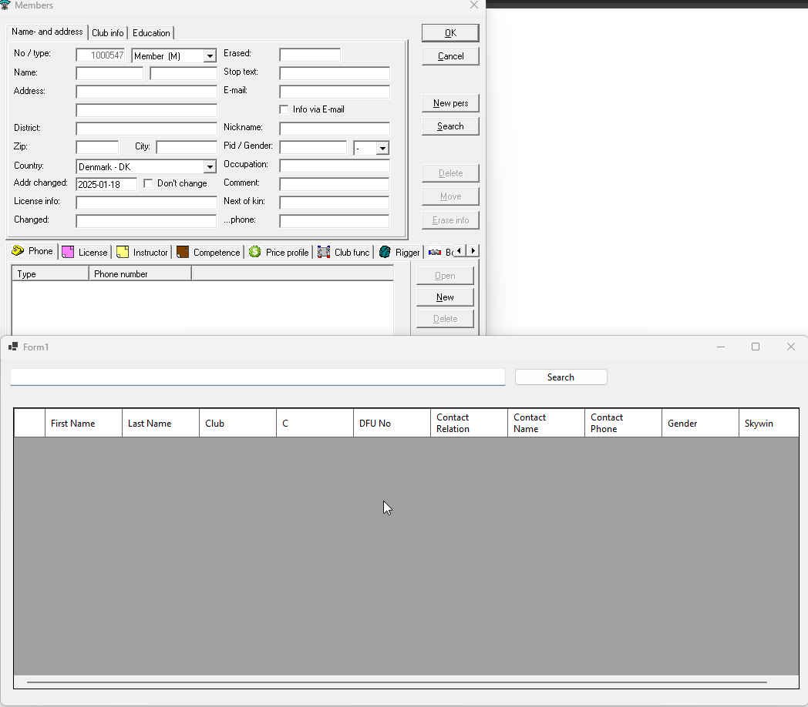

# ClubAPI

Welcome to the ClubAPI repository!   
This project is designed to support the Danish skydiving club VAF13, which operates under the Danish Skydiving Federation ([DFU](https://dfu.dk/) - Dansk Faldskærms Union).   
The API interfaces with DFU's member management system, Klubadmin, to provide streamlined access to member data for various purposes.    

## Origin anecdote

ClubAPI started out as an experiment for improving a slow process.
Before allowing people to jump at our club we have to register them in a manifest system named [Skywin](https://skywin.se/).  
That meant having people handwrite their information, ICE and a few other things and then type it into Skywin.   
As a software engineer that was a slow and annoying process that something could be done to improve.

So I started to investigate how to insert data into Skywins UI programmatically and found it was possible through Win32 API.

I then started to investigate how to get the data from DFUs member management system Klubadmin could be accesed and created an API wrapping around it.

## Overview

The API is implemented in both C# and Golang, and both have the same functionality and setup, with the Go version serving as a learning exercise.

Additionally, a Windows Forms C# application is available to interact with the API, allowing for data integration with Skywin.

## Features

### API

- **Fetch Member Details**: Retrieve detailed information for a specific member using their `PersonId`.
- **Search Members**: Perform searches to retrieve basic details for members by name.
- **Comprehensive Member Search**: Combine basic search with detailed information retrieval for each member.

### Skywin Integration Windows Forms application

- **Query API**:  Queries the API for member details.
- **Insert into Skywin**: Insert queried data into the manifest system [Skywin](https://skywin.se/).



## Configuration


Example configuration in a `.env` file:
```text
DfuConfiguration__Username=
DfuConfiguration__Password=
ApiConfiguration__ApiKey=
```

The Windows Forms application reads the API key and the API baseUrl from `appsettings.json`
    
```json
{
   "UIConfiguration": {
      "ApiEndpoint": "",
      "APIKey": ""
   }
}
```


### Klubadmin Credentials

To access Klubadmin, you need to configure user credentials.  
These credentials should be stored securely and not hard-coded in the source code. 
You can use environment variables or a secure configuration file to manage these credentials.

### API Key Security

The API requires an API key for authentication when being called. 
Middleware takes care of this and checks the key before allowing access to the endpoints.
This key should be included in the `X-API-Key` header of each request to the APIs

Both application current reads the API key from the environment variable 
`ApiConfiguration__ApiKey`

Example header:
```
X-API-Key:  YOUR_API_KEY
```

## Endpoints

1. **Get Member Details**
   - **Endpoint**: `/api/member/Person`
   - **Method**: GET
   - **Parameters**: `PersonId` (required)
   - **Description**: Fetches detailed information for a member identified by `PersonId` from Klubadmin.
   - **Example**:
     ```bash
     curl -X GET --header "X-API-Key: XXXXXX" "http://localhost:5000/api/member/Person?PersonId=1"
     ```

2. **Search Members**
   - **Endpoint**: `/api/member/Search`
   - **Method**: GET
   - **Parameters**: `name` (required)
   - **Description**: Searches for members by name and retrieves basic details from Klubadmin.
   - **Example**:
     ```bash
     curl -X GET --header "X-API-Key: XXXXXX" "http://localhost:5000/api/member/Search?name=Nikolaj"
     ```

3. **Comprehensive Member Search**
   - **Endpoint**: `/api/member/SearchAll`
   - **Method**: GET
   - **Parameters**: `name` (required)
   - **Description**: Searches for members by name, retrieves basic details, and iteratively fetches all details for each member from Klubadmin.
   - **Example**:
     ```bash
     curl -X GET --header "X-API-Key: XXXXXX" "http://localhost:5000/api/member/SearchAll?name=Nikolaj"
     ```

## Technology Stack

- **C#**: Used for the primary implementation of the API.
- **Golang**: Developed as a secondary implementation for learning purposes.

## External Systems

- **Klubadmin**: The DFU's member management system from which the API fetches data.
- **Skywin**: A manifesting system where data retrieved by the API can be inserted using the Windows Forms application.

## Run

### Docker

The supplied `docker-compose.yml` file can be used to run both dotnet and Golang API in  Docker containers.
Just create a `.env` file with the required configuration and run `docker-compose up`.

An example `.env` file is provided below:
```text
DfuConfiguration__Username=
DfuConfiguration__Password=
ApiConfiguration__ApiKey=
```

## Usage

Once the API is running, you can access the endpoints using a tool like `curl`, Postman, or the Windows Forms application.

## Contributing

Contributions are welcome! Please fork the repository and submit a pull request for any enhancements or bug fixes.

## Contact

For any questions or support, please create an issue in the repo.


